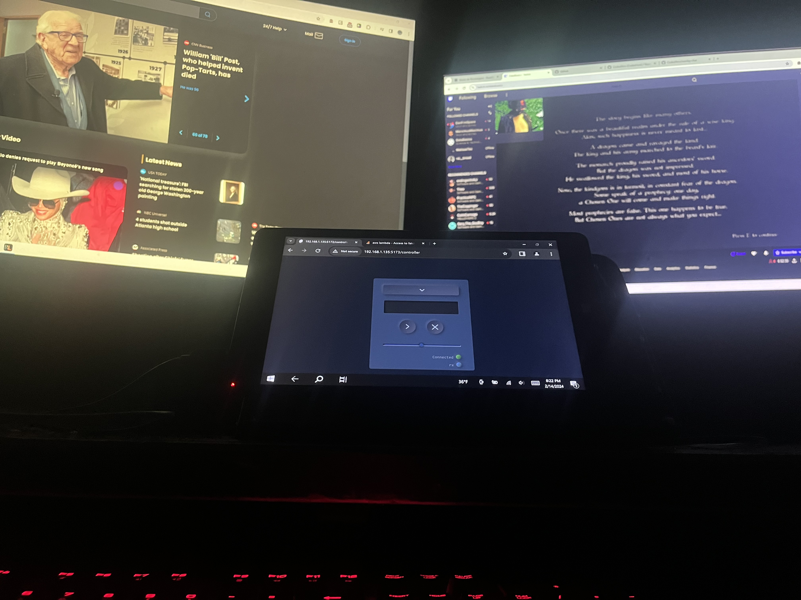
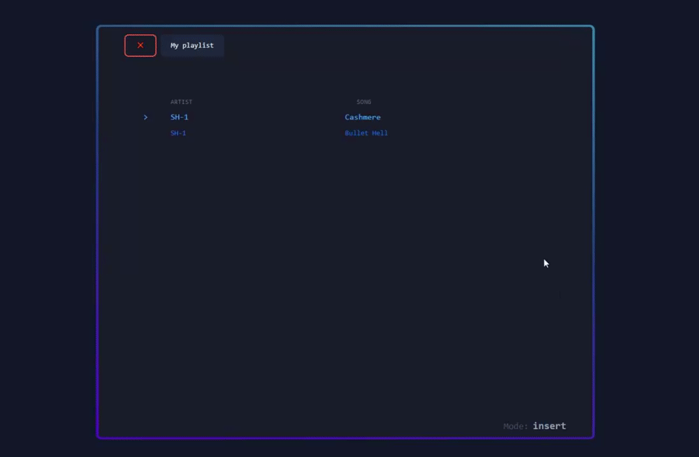
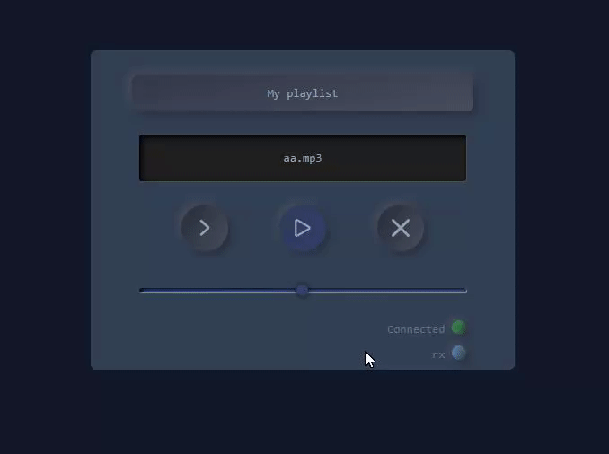

## Remote media interaction over LAN
Provides management tooling for audio and media control on a remote device. The interface provides a software solution meant to mimic hardware devices such as the stream deck, and can be extended to provide other custom functionality.

### Adding and Reordering playlist media
 

## Local Client:    
A multi-channel audio control server application with status and control HTTP directives. 

## Web Client:
GUI for configuration as well as interaction with features exposed by the local client.

 
 
 

### Dev Requirements:
1. Svelte
2. Tailwind
2. Docker (Postgres)
3. Python
