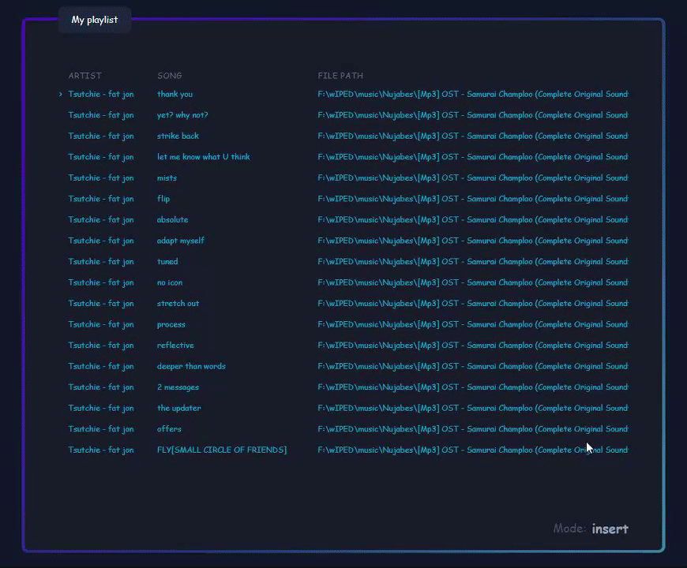

### Reordering playlist media

### Adding new songs from media folder

### Web client

## Local Client:    
A multi-channel audio control application with status and control HTTP directives. 

## Web Client:
GUI for configuration as well as interaction with the local client.

 
 
 

### Dev Requirements:
1. Svelte
2. Tailwind
2. Docker (Postgres)
3. Python
